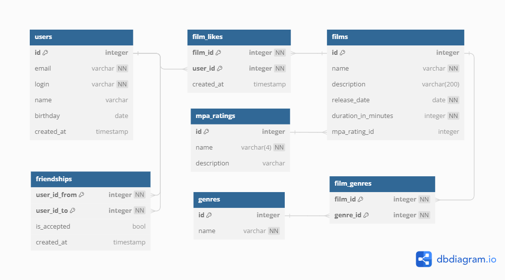

# Java Filmorate

A simple film rating in-memory application. Powered by Spring Boot.

## Entity Relationship Diagram

Below is the Entity Relationship Diagram:



Below is the Entity Relationship of the project in [DBML format](https://dbml.dbdiagram.io/home):

```dbml
Project FilmorateER {
  database_type: 'PostgreSQL'
  Note: 'Entity Relationship diagram for Filmorate'
}

Table users {
  id integer [pk, increment]
  email varchar [not null, unique]
  login varchar [not null, unique]
  name varchar
  birthday date
  created_at timestamp
}

Table friendships {
  user_id_from integer [ref: > users.id, not null]
  user_id_to integer [ref: > users.id, not null]
  is_accepted bool [default: false] 
  created_at timestamp
  indexes {
    (user_id_from, user_id_to) [pk]
  }
}

Table films {
  id integer [pk, increment]
  name varchar [not null]
  description varchar(200)
  release_date date [not null]
  duration_in_minutes integer [not null]
  mpa_rating_id integer [ref: > mpa_ratings.id]
}

Table film_genres {
  film_id integer [ref: > films.id, not null]
  genre_id integer [ref: > genres.id, not null]
  indexes {
    (film_id, genre_id) [pk]
  }
}

Table film_likes {
  film_id integer [ref: > films.id, not null]
  user_id integer [ref: > users.id, not null]
  created_at timestamp
  indexes {
    (film_id, user_id) [pk]
  }
}

Table genres {
  id integer [pk, increment]
  name varchar [not null]
}

Table mpa_ratings {
  id integer [pk, increment]
  name varchar(4) [not null]
  description varchar
}
```

Query bellow returns a friends id list for `:user_id`.

```sql
SELECT
    user_id_to AS friend_id
FROM
    friendships
WHERE
    user_id_from = :user_id
    AND is_accepted = true
UNION
SELECT
    user_id_from AS friend_id
FROM
    friendships
WHERE
    user_id_to = :user_id
    AND is_accepted = true;

```
